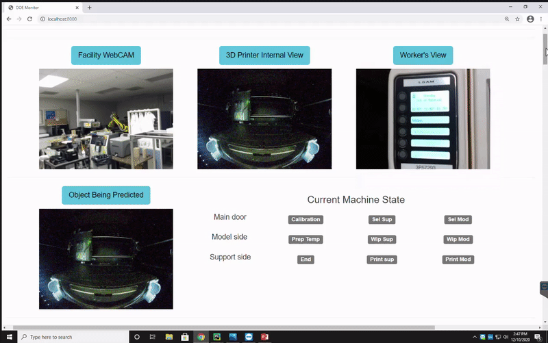
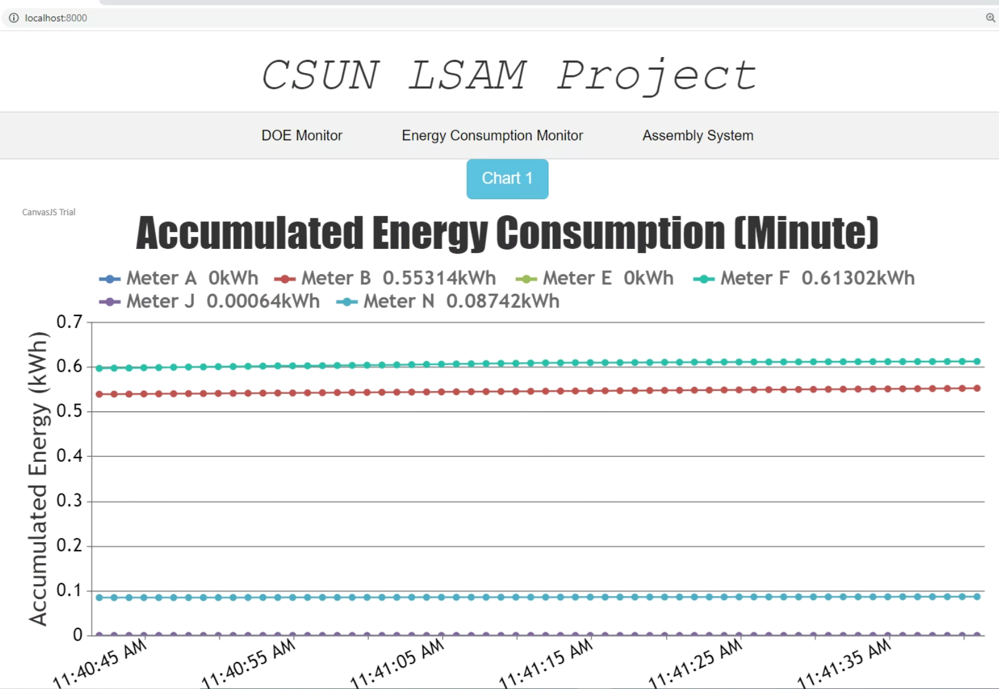
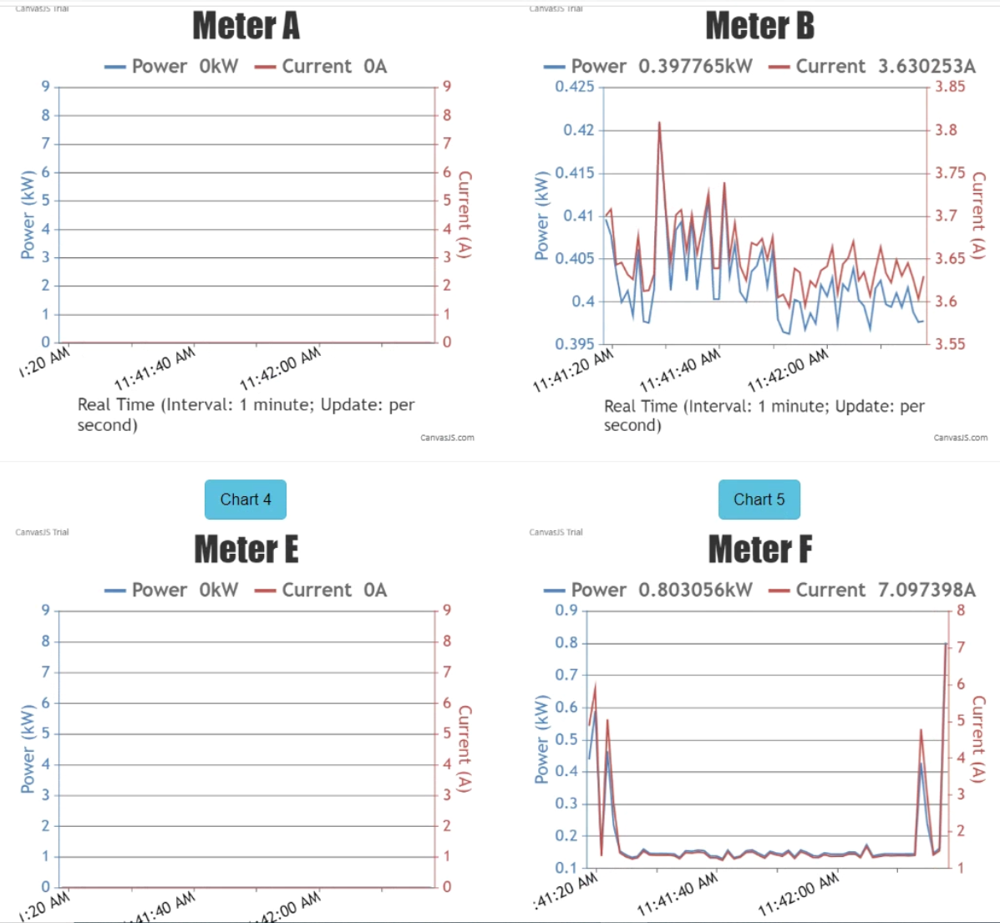

# Project: Smart Connected Worker (SCW) - Version 1.0

This is the research project **Smart Connected Worker (SCW)** funded by the Clean Energy Smart Manufacturing Innovation Institute (CESMII) and U.S. Department of Energy (DOE), supervised by **Professor Bingbing Li** of California State University, Northridge (CSUN), and managed by **Shijie Bian** of the University of California, Los Angeles (UCLA). Other contributors to this project include (affiliations based on year 2021): Chen Li (UCLA), Tiancheng Lin (UCLA), Yongwei Fu (CSUN), Ruitao Wu (CSUN), Tongzi Wu (UCLA), Mengrui Jiang (University of Columbia), Yutian Ren (UCI). This project has been published in the [Journal of Manufacturing Systems](https://www.sciencedirect.com/science/article/pii/S0278612521001813).

**The main goal of this project is to develop enabling technologies for establishing smart and connected infrastructure, to empower workers and operation supervisors in optimizing manufacturing workflow, which may allow us to improve energy efficiency and productivity in advanced manufacturing environments.** In order to do so, we utilized machine learning algorithms related to object detection, text recognition, and reinforcement learning. In high-level summary, we built an automated system for real-time workplace monitoring and information analysis, as well as a web-based graphical user interface for centralized data visualization and analysis.


## Introduction and Overview

This Smart Connected Worker (SCW) Project consists of three main machine learning-based modules (for more detailed information please refer to the individual GitHub projects): 

1. The [object detection module](https://github.com/BrandonBian/SCW-object-detection) for real-time automated machine state monitoring and behavior supervision;
2. The [finger and text recognition module](https://github.com/BrandonBian/SCW-finger-text-detection) for real-time human-machine interaction control in manufacturing systems;
3. The energy disaggregation module (currently under development) for making real-time power consumption predictions.



## Step 1: Installation

```
git clone https://github.com/BrandonBian/SCW-V1.0.git
cd SCW-V1.0
pip install -r requirements.txt
```

Note that you may need **Windows** operating system and **PyTorch** with a compatible GPU to run the program optimally.
The program has been tested with **Windows 10, PyTorch 1.6.0, and a GPU of NVIDIA RTX 2070**.

For the installation of PyTorch, please refer to the [official website](https://pytorch.org/get-started/locally/)
For installation of previous versions of PyTorch (for example, the version 1.6.0 that was tested on), refer to [this page](https://pytorch.org/get-started/previous-versions/).


## Step 2: Download Pre-trained Weights

```
# Create a directory named 'weights' in the SCW-V1.0 root directory.
# Not sure if this wget from google drive works. If it doesn't, follow the alternative steps to download.
cd weights
wget https://drive.google.com/file/d/1XrfeUAppVzBK4A6DT92UttHZoljDv3Ft/view?usp=sharing
wget https://drive.google.com/file/d/1uPHybaMrCO0iIz_4RAL44vn4iVxdK1xC/view?usp=sharing
wget https://drive.google.com/file/d/1nn9LtvmkGrpOyMc9r9ZJYiJu6JEbwGB9/view?usp=sharing
```
Or, you can just download the following weights from my google drive and copy them into a "weights" directory:
1. [yolov3_journal.pth](https://drive.google.com/file/d/1XrfeUAppVzBK4A6DT92UttHZoljDv3Ft/view?usp=sharing): the pre-trained weight for performing real-time YOLO-based object detection of the printer interior camera.
2. [craft_mlt_25k.pth](https://drive.google.com/file/d/1uPHybaMrCO0iIz_4RAL44vn4iVxdK1xC/view?usp=sharing): for performing the CRAFT-based text-detection module.
3. [TPS-ResNet-BiLSTM-Attn.pth](https://drive.google.com/file/d/1nn9LtvmkGrpOyMc9r9ZJYiJu6JEbwGB9/view?usp=sharing): Similarly, for performing the CRAFT-based text-detection module.

## Step 3: Configuration for Smart Meter Connection (Modbus)

In the "/utils/" directory is the python file **smartmeter_modbus.py**, which consists of the code that connects to the smart meter via Modbus wireless connection, obtain the digital data, and stores the data into a list to be processed in the main program.

In line 42 is the code for connecting to the smart meter, and line 52 is the example of obtaining the digital data from the smart meter:

```
master = modbus_tcp.TcpMaster(host='192.168.1.3', port=502) # Line 42
A_power = master.execute(1, cst.READ_HOLDING_REGISTERS, 1167, 2) # Line 52
```

So for your custom smart meter connection, you need to change the host number and the port to connect the master device to the smart meter ([reference](https://code.google.com/archive/p/modbus-tk/wikis/ModbusMasterExample.wiki)).
Then, you need to configure the **master.execute** function using the slave ID, the function code, the starting address, and the output value (see the same reference above).
The information that you need should be given by the manufacturer of the smart meter (or from a user guide).

The **ReadFloat** function is to decode the digital data obtained from the smart meter into the format and unit that we want.

## Step 4: Configuration for Cameras

In this SCW project, three cameras are utilized to monitor the workflow of the manufacturing system: 1. the **worker camera**, located on the headset of the operator, monitors the operator's vision during human-machine interaction; 2. the **printer camera**, located inside the 3D printer (which is the case study of our project), monitors the motion and behavior of the machine during its operation; 3. the **web camera**, which is a global surveillance camera that monitors the entire lab.

These three cameras are connected using wired-connection to the master device (the computer that this program runs on) in the following code from the **main.py**:

```
worker_camera = cv2.VideoCapture(0, cv2.CAP_DSHOW) # Line 218
printer_camera = cv2.VideoCapture(3, cv2.CAP_DSHOW) # Line 219
web_camera = cv2.VideoCapture(1, cv2.CAP_DSHOW) # Line 220
```
Here, you need to change the integer number according to the camera port number of each camera.

## Step 5: Customized Training

For the training of the YOLO-based object detection model, follow this [Colab Notebook](https://colab.research.google.com/drive/1b9tqeVFkMeuDiKbXy1MkQ1w3IntuU11G?usp=sharing). Specifically, we are using the PyTorch implementation of the YOLO-V3 from this [GitHub](https://github.com/eriklindernoren/PyTorch-YOLOv3/tree/8eea432831a74d3cbeed4ecb79097db893ee8488). You need to collect at least 2000 image frames from the interior of your 3D printer, label them using the [Vott](https://github.com/microsoft/VoTT#download-and-install-a-release-package-for-your-platform-recommended) tool provided by Microsoft Visual Object Tagging Tool. Then, train the YOLO model following the procedure and guidelines provided by the GitHub and Colab Notebook. Note that fine-tuning of model hyperparameters as well as providing a diverse dataset are recommended.

The module for text and finger detection/recognitions utilize pre-trained models that do not need to be re-trained anymore. The Pytorch implementation of the CRAFT model is provided [here](https://github.com/clovaai/CRAFT-pytorch).

The module for energy disaggregation is still currently under development. The training of the LSTM model can be referenced [here](https://github.com/minhup/Energy-Disaggregation) and this [secondary source](https://github.com/pipette/Electricity-load-disaggregation).


## Supplementary Information and Update History (Keep Updating)

### 1. Using "ngrok" to forward webpage-GUI to other computers via the Internet (06/09/2021)

To access the webpage-GUI on other computers that are not connected to the server/master device via a local network, we used the "ngrok" as an initial and hopefully temporary approach.

1. Download ngrok [here](https://ngrok.com/download) and install.
2. Add the environment of the ngrok.exe to your computer
3. Run our program on your computer and establish the webpage-GUI on localhost:8000 on the computer
4. Run ngrok.exe with input "localhost 8000"
5. Other computers can enter the URL provided by ngrok to access the webpage-GUI in real-time (note that free connection lasts 2 hours and support only one connection per time)


### 2. Recommended: using "localtunnel" to forward webpage-GUI to other computers via the Internet (06/12/2021)

LocalTunnel is probably a better alternative to ngrok, since it is free and not limited in connection time.

1. Install localtunnel according to the [GitHub](https://github.com/localtunnel/localtunnel)
2. Run our program on your computer and establish the webpage-GUI on localhost:8000 on the computer
3. Run localtunnel by opening the command line window and typing in the command:

```
lt -p 8000 -s [your customized subdomain name]

e.g.: lt -p 8000 -s doemonitor
```

4. Copy the URL given and enter it through any device connected to the internet to access the DOE web page-based monitor GUI. Note that you would need to keep the server (the Python file on the master device PC) running at all times. 


### 3. Updated GUI HTML template (06/23/2021)

We provide a better alternative HTML template for the web page-based GUI. The new templates are in the folder /templates/.
To use these new templates, please go inside the **main.py** and perform the following changes:

Locate **line 175**:

```
@app.route('/')
def index():
    return render_template("index.html")
```

Change it into the following:

```
@app.route('/')
def index(): # Render the new GUI template
    return render_template("sample.html")
```

In this updated GUI, there will be tags/buttons so that you can choose what information to display on the main site (instead of having all information displayed).
Note that you can always use the previous version of the GUI **by not changing the main.py file**.

### 4. Demonstration Screenshots for Updated GUI (06/23/2021)

I will put here some screenshots for the preview of the updated GUI:



The screenshot above shows that there are three sections on the top of the webpage: the **DOE Monitor** displays the real-time camera images, the processed images by the machine learning modules, as well as the predicted results of the machine learning modules; the **Energy Consumption Monitor** displays the dynamic line charts that monitor the energy consumption of the smart meters; the **Assembly System** displays the camera monitor of the assembly system - this part is still under construction.




The screenshot above displays the dynamic line charts of the individual smart meter readings - all in real-time.

So the updated GUI divides the webpage into three main sections so that things will not be all piled up together.

## Acknowledgement

This research is mainly supported by the Technical Roadmap Project "Establishing Smart Connected Workers Infrastructure for Enabling Advanced Manufacturing: A Pathway to Implement Smart Manufacturing for Small to Medium-Sized Enterprises (SMEs)" funded by the Clean Energy Smart Manufacturing Innovation Institute (CESMII) sponsored through the U.S. Department of Energy's Office of Energy Efficiency and Renewable Energy (EERE) under the Advanced Manufacturing Office (Award Number UCLA: 20190511-16/DOE: DE-EE0007613).

This research is also supported by the project "Autonomy Research Center for STEAHM" sponsored through the U.S. NASA MUREP Institutional Research Opportunity (MIRO) program (Award Number 80NSSC19M0200).

## Other Information

If you find this project to be useful, please consider citing [our paper](https://www.sciencedirect.com/science/article/pii/S0278612521001813):

```
@article{BIAN202166,
title = {Machine learning-based real-time monitoring system for smart connected worker to improve energy efficiency},
journal = {Journal of Manufacturing Systems},
volume = {61},
pages = {66-76},
year = {2021},
issn = {0278-6125},
doi = {https://doi.org/10.1016/j.jmsy.2021.08.009},
url = {https://www.sciencedirect.com/science/article/pii/S0278612521001813},
author = {Shijie Bian and Chen Li and Yongwei Fu and Yutian Ren and Tongzi Wu and Guann-Pyng Li and Bingbing Li},
keywords = {Smart connected worker, Machine learning, Real-time monitoring, Object detection, Text recognition, Energy disaggregation},
abstract = {Recent advances in machine learning and computer vision brought to light technologies and algorithms that serve as new opportunities for creating intelligent and efficient manufacturing systems. In this study, the real-time monitoring system of manufacturing workflow for the Smart Connected Worker (SCW) is developed for the small and medium-sized manufacturers (SMMs), which integrates state-of-the-art machine learning techniques with the workplace scenarios of advanced manufacturing systems. Specifically, object detection and text recognition models are investigated and adopted to ameliorate the labor-intensive machine state monitoring process, while artificial neural networks are introduced to enable real-time energy disaggregation for further optimization. The developed system achieved efficient supervision and accurate information analysis in real-time for prolonged working conditions, which could effectively reduce the cost related to human labor, as well as provide an affordable solution for SMMs. The competent experiment results also demonstrated the feasibility and effectiveness of integrating machine learning technologies into the realm of advanced manufacturing systems.}
}
```
